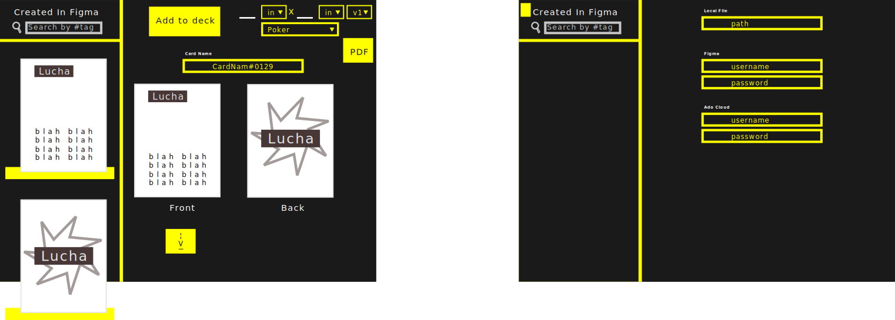

# CardStax App

## What is it trying to solve

During Card Game development, it is good to use SVG to create cards, however, there are constant changes that need to be made to cards as testing continues. In order for this iteration process to have quick speeds, the following requirements are needed.
1. Changing colors because during test, colors confused players from a database. local or remote storage.
2. Reusing icons of different sizes by getting the icon from an id and changing default properties.
3. Breaking down cards into re-usable components.
4. Fixing typos on cards by changing the values on a local or remote storage.
5. Create cards using the broken down components and changing default values if necessary.

In summary we want to connect the tools we use to make the re-iteration process faster--smoother.

## Tools Used

### Figma
For creating svg components, symbols, and styles. Makes it simple to reuse card components.

### The Game Crafter
Used to manufacture the cards. And handle transactions.

## Requested Features
Let's see if we can begin by connecting our tools together when we test for fast iterations.

### Creating Decks in Game Crafter API
It would be good to create our decks from Figma's creation. If after testing we find changes needed, we can update them from this app. 

### Figma API to Game Crafter API
Being able to get Figma's cards into Game Crafter API will be our main goal. Pushing png's to the correct deck.

### QA PNGs
GameCrafter has an approve button that forces the user to take a double look at the card before it's published. It would be nice if we add a QA feature to the app. Where we can run test or just hit an approval button from atleast 3 people before allowing approval of the card on Game Crafter. NEED MORE INVESTIGATION TO SEE IF GAME CRAFTER ALREADY SUPPORTS THIS.

## Front End
Quasar Framework 1.0+
1. UI that makes API calls to Game Crafter for creating decks.
2. UI that Setup cards ready to be pushed to Game Crafter
3. UI that pushed the queue of cards/decks created above

## Mock Ups

 

## Future Features

### Place orders and Make Transactions
When we go sell the game to local shops and conventions, it would be nice to place orders and make transaction off the app. Or have an API to put a shopping cart in our site so people can buy from there.

### Alert Other Admins to Review cards pushed to game crafter
This is a maybe, game crafter might send emails already, and if so no need to double dip yet.